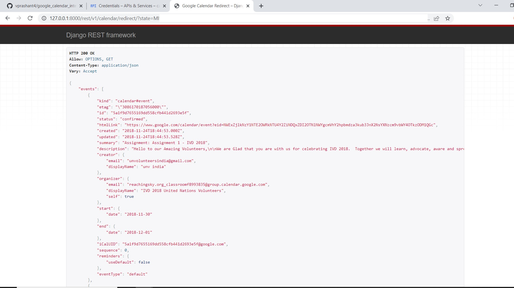

## Google Calendar API OAuth 2.0 for Web Server Applications Integration - Django Rest Framework

Problem: In this assignment you have to implement google calendar integration using django rest api. 
You need to use the OAuth2 mechanism to get users calendar access. Below are detail of API endpoint and corresponding views which you need to implement

For run this project on a local machine: 

- Create virtual environment

https://packaging.python.org/guides/installing-using-pip-and-virtual-environments/

```sh
pip install - r requriments.txt
```

- Endpoint:
```
/rest/v1/calendar/init/ -> google_calendar_init_view()
```
This view should start step 1 of the OAuth. Which will prompt user for his/her credentials

```
/rest/v1/calendar/redirect/ -> google_calendar_redirect_view()
```


This view will do two things
1. Handle redirect request sent by google with code for token. You
need to implement mechanism to get access_token from given
code
2. Once got the access_token get list of events in users calendar

